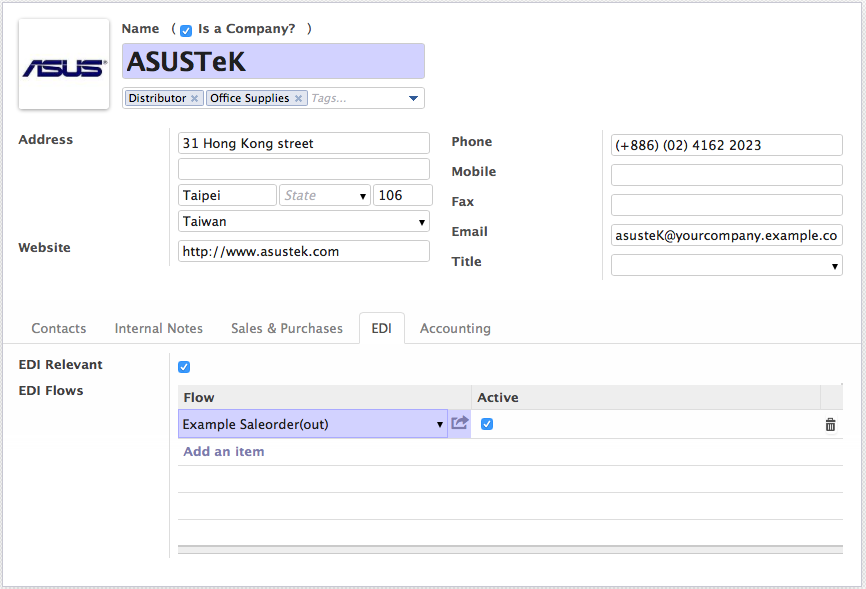
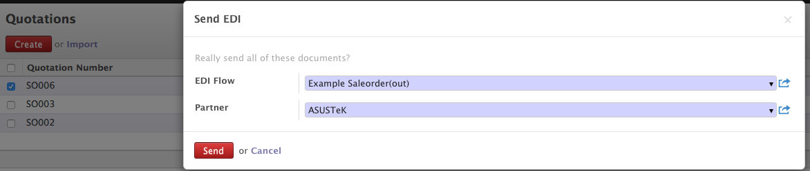
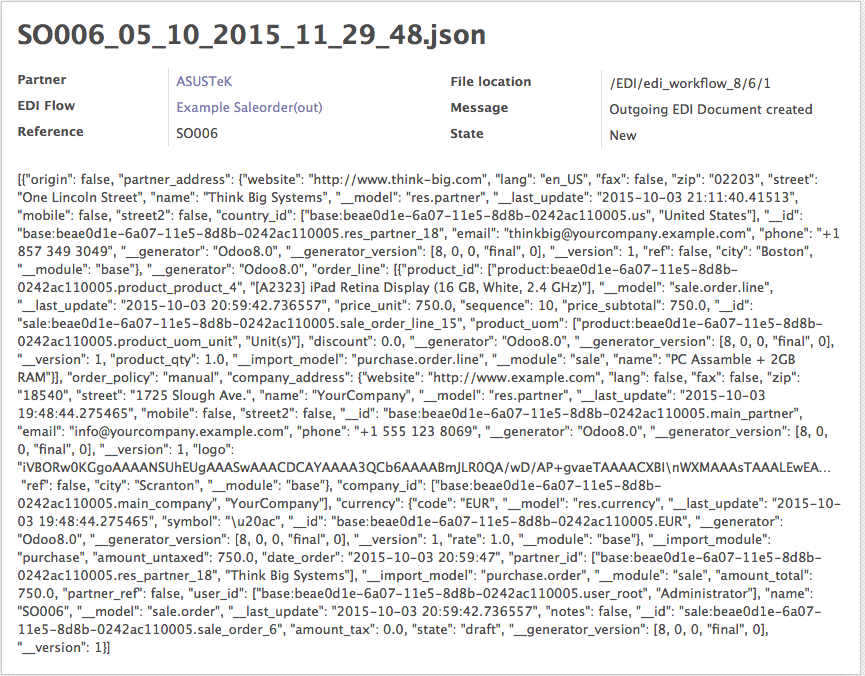
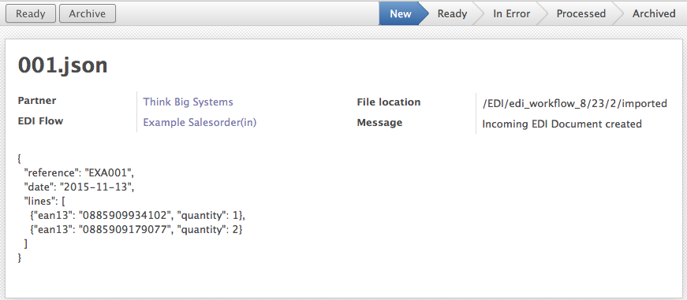
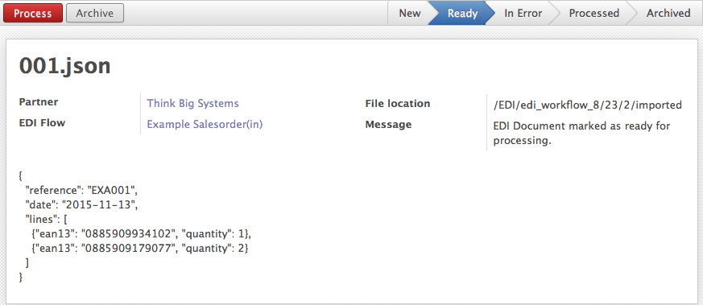
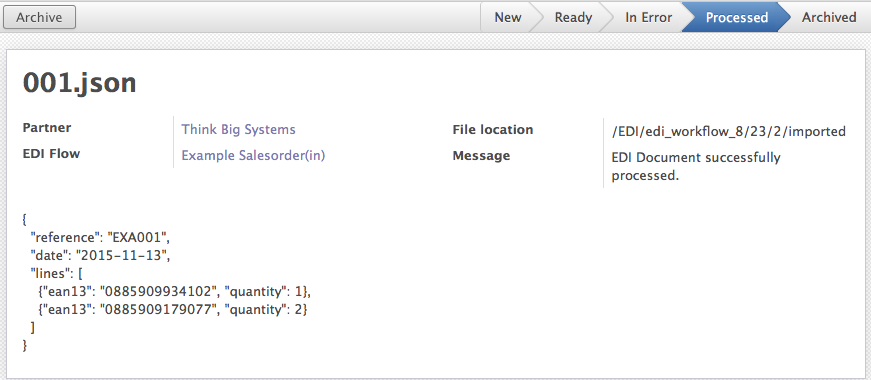

.. EDI Workflow for Odoo documentation master file, created by
   sphinx-quickstart on Wed Sep 23 16:17:26 2015.
   You can adapt this file completely to your liking, but it should at least
   contain the root `toctree` directive.

.. toctree::
   :maxdepth: 2

   index

EDI Workflow for Odoo
=====================

ERP systems are often placed in the center of business IT systems as they can perform multiple tasks and deliver a highly integrated system. Being at the center, often required them to be able to communicate with other systems (e.g. suppliers, customers, various internal IT systems) in a variety of ways.

This framework is an attempt to fill the void that exists in the current Odoo eco-system. It is loosely based on the EDI framework that exists within SAP R/3. Its main goals are:

* Traceability of all communication (incoming and outgoing)
* Build for file based communication, but extensible enough to support other ways of communication as well
* Integrate into Odoo interface and allow end-users to take action and resolve possible issues

The framework doesn't solve the issue of communicating with other systems over certain protocols (e.g. FTP, mail, AS2, X400) in certain formats (EDIFACT, csv, JSON, xml). This is a topic on itself and there is software available that does exactly this. For example, the open source software bots (http://bots.sourceforge.net) is a very good complement to this.

------------
Architecture
------------

EDI Tools (edi_tools) is the main module with all the base components. It encompasses a number of objects, which all work together to allow document sending/receiving automation. A new EDI flow can be developed, it can then be applied to a partner so documents can finally be sent or received for that flow. The edi_tools module doesn’t actually implement any flows/documents itself, it just describes and implements the framework to which flows must conform.

The diagram below depicts the datamodel.

.. figure:: images/edi_workflow_architecture.png

The communication between other systems is intended to be asynchronous. This helps to make it scalable, traceable and recover from possible errors. For incoming documents the flow is as follows.

1. EDI document is created. The default way is by the process which scans the EDI folders.
2. The EDI document can now be validated and processed. When successful, the flow stops here.
3. The EDI document is in error. The user can edit the content directly in Odoo or choose to archive it.

For outgoing flows, the process is quite similar.

1. EDI document is created as the result of an event in Odoo (e.g. wizard, creation of a record). A file with the content is created in the appropriate folder.
2. The communication is now either outside the system. The flows stop here, or inside the system where it continues
3. The dogmatic approach is to let a scheduler scan for outgoing EDI documents and let it handle communication. When successful the state of the document is put as processed/done.

The following sections discuss each component in more detail.

--------
EDI Flow
--------

The flow object is root object of the EDI framework. A flow contains the definition of what your EDI is going to be about. What is its name, is it incoming or outgoing, which model is it for, etc. A flow is not dependent on a partner. Instead, a partner should listen to a flow so reusability across multiple partners is possible.

------------
EDI Document
------------

An EDI document contains the actual information being transferred from one system to another for a given flow. An EDI document is an abstraction of a physical file that is received or sent, and it will track the actual file’s location. It is possible to edit the document in Odoo, allowing differences between the content stored in the database and that of the file to occur. It is technically implemented in 3 classes, a super class and an incoming and outgoing subclass since they are slightly different.

+++++++++++++++++++++
EDI Incoming Document
+++++++++++++++++++++

The incoming EDI document is the only one that is actually tracked by a workflow. To facilitate the workflow processing, a new attribute ``processed`` is introduced that indicates if the processing state of the document and consequently moving it (via the workflow) to the ``state`` processed.

+++++++++++++++++++++
EDI Outgoing Document
+++++++++++++++++++++

The outgoing document doesn't necesseraly need a workflow attached to it as it is generated inside the system with a purpose to be communicated with other systems. The standard behavior is that a file is generated that can be picked up by another application (e.g. bots) to be transferred to its destination (e.g. customer FTP folder).

-------------
Configuration
-------------

The default modus operandi to get new incoming edi documents is to look for files on the filesystem. To allow this, a folder need to be created (default this is ``/EDI``, with the proper access rights assigned to it.

What happens now is that inside this folder, a folder is created per database. Inside this folder there is a tree structure with the following pattern

.. code-block:: console

  /EDI/database_name/partner_id/flow_id

These folders are created and updated when flows are assigned to partners in Odoo. The structure is important as it allows the module to determine the partner and the flow for which the incoming edi document is intended.

The database folder contains a file called ``partners.edi`` (a simple text file) that tracks the currently assigned partners and their flows. This is always handy when looking in the file system in search for some documents.

--------
Security
--------

When installing the base ``edi_tools`` module, the group *EDI User* is created. Add your user to the group to see the top level *EDI* menu item.

------------------
Coding Style Guide
------------------

This section describes the coding style of a new EDI module. Following these guidelines ensures a certain level of consistency and familiarity across all modules, which benefits developer productivity. While the framework doesn't enforce any of these, following them is strongly encouraged.

+++++++
Methods
+++++++

  | *There are only two hard things in Computer Science: cache invalidation and naming things.*
  | -- **Phil Karlton**

Use the following method naming structure (`edimodule` is the variable).

* ``send_edi_export_edimodule`` is the method that is called by a wizard after selecting the documents to be exported in the UI.
* ``edi_export_edimodule`` implements the core functionality and returns a content string.
* ``valid_for_edi_export_edimodule`` is a validation method that validates if the document is allowed to be exported.

---------------------
Sample Implementation
---------------------

The repository already contains a number of modules that can serve as a guide in your next endeavour. This section merely discusses one such implementation.

Also, to make it easier to start, a boilerplate edi route foler is available (aptly named ``edi_routes_boilerplate``) that already contains the basic files, which allows you to get started even more quickly, so go ahead, copy this folder and start tinkering with it.

As an example we'll implement import and export for a sale order. The idea could be that certain orders need to be send to a supplier, e.g. dropshipping the orders. The import scenario could be enabled for certain customers to allow them to ask

All the code is available in the edi route ``edi_routes_example_saleorder``, here we highlight and annotate the code a bit.

+++++++++++++++
EDI Sale Export
+++++++++++++++

After the boilerplate code is copied, set some basic thing in order

* Update the ``__openerp__.py`` code with the correct meta info (tip don't forget to put the ``installable: True`` flag)
* Rename ``models/model.py`` to ``models/sale.py`` and change the import statement in ``models/__init__.py`` to import ``sale.py`` file.

Let's first create all the necessary methods for the export module. First up is the method that actually returns the body content for the edi document.

We piggy back on an existing method in Odoo that handles this.

.. code-block:: python

  @api.model
  def edi_export_example_saleorder(self, order):
      return self.env['sale.order'].edi_export(order)

Next we implement the method that will be called when the user selects the orders to be send. This method takes two arguments

* a recordset of the model in question
* the id of the partner for which the edi document will be created

The first block checks if the selected orders are actually allowed to be send via edi. If documents in the list are invalid, a popup will be shown and the action is aborted.

The second part loops over the selected orders, gets the content for the file (via the previously implemented method) and creates the edi outgoing document.

.. code-block:: python

  @api.multi
  def send_edi_export_example_saleorder(self, partner_id):
      valid_orders = self.filtered(self.valid_for_edi_export_example_saleorder)
      invalid_orders = [p for p in self if p not in valid_orders]
      if invalid_orders:
          raise except_orm(_('Invalid sale orders in selection!'), _('The following sale orders are invalid, please remove from selection. %s') % (map(lambda record: record.name, invalid_orders)))
      for order in self:
          content = order.edi_export_example_saleorder(order)
          result = self.env['edi.tools.edi.document.outgoing'].create_from_content(order.name, content, partner_id.id, 'sale.order', 'send_edi_export_example_saleorder')
          if not result:
              raise except_orm(_('EDI creation failed!', _('EDI processing failed for the following order %s') % (order.name)))
      return True

To determine if the orders are allowed to be send, the following method is implemented. It checks if the state of the sale order is still in draft, i.e. it is a quote.

We're using the ``filtered`` method on the recordset to filter out the valid orders. If not all orders are valid for export, the invalid order names are returned.

.. code-block:: python

  @api.model
  def valid_for_edi_export_example_saleorder(self, record):
      if record.state != 'draft':
          return False
      return True

We're almost there. Now we implement the ``config.xml`` to configure the edi framework with the new flow. This allows the flow to be added to the partner and as a result it can be picked in the wizard.

.. code-block:: xml

  <?xml version="1.0" encoding="UTF-8"?>
  <openerp>
      <data>
          <record id="edi_example_saleorder_model_out" model="edi.tools.edi.flow">
              <field name="name">Example Saleorder(out)</field>
              <field name="direction">out</field>
              <field name="model">sale.order</field>
              <field name="method">send_edi_export_example_saleorder</field>
          </record>
      </data>
  </openerp>

The edi tools app makes a wizard available for sending edi documents, but it is not enabled for all objects by default. To enable it for the ``sale.order`` object, you need to install the app ``edi_sale_enable`` and add it as a dependency. Conveniently, this app is already available, but using the code to enable it for other objects is really easy.

The last step in making this work is to enable the flow for a partner, namely the one for which the document is intended. In our example this could be the supplier that takes care of dropshipments.

The moment of truth. Go to the list view of quotations, select the quotations you want to send and click *More > Send EDI*. A wizard pops up where the flow and the partner can be selected. Press *Send*.

The result of all this hardship is now visible *EDI > Outgoing Documents*.

+++++++++++++++
EDI Sale Import
+++++++++++++++

Allowing a customer to send quotations in edi format is something typically required in highly automated environments. An example is an e-commerce frontend implemented in an other framework or a B2B communication channel.

Let's get started with the configuration this time. Edit the ``data/config.xml`` file and add the block to define sale order import.

.. code-block:: xml

  <record id="edi_example_salesorder_delivery_in" model="edi.tools.edi.flow">
      <field name="name">Example Salesorder(in)</field>
      <field name="direction">in</field>
      <field name="model">sale.order</field>
      <field name="method">receive_edi_import_example_salesorder</field>
      <field name="validator">edi_import_example_salesorder_validator</field>
  </record>

The document is imported and put in state *new*. No processing is done (unless configured).

There are two methods that need to be implemented. The validator and the actual import method. The validator function is to check if the structure and contents of the data to what we expect it to be. In our example we expect the following (overly simplified) json structure.

.. code-block:: json

  {
    "reference": "EXA001",
    "date": "2015-11-13",
    "lines": [
        {
            "ean13": "0885909934102",
            "quantity": 1
        },
        {
            "ean13": "0885909179077",
            "quantity": 2
        }
    ]
  }

The validator's intention is to separate all the checking logic from the import method to avoid cluttering. In our example, we check the following things:

* Correct json structure
* Check if ean13 elements are provided on the lines
* Check if the ean13 is linked to a product in the system

If one of these check fails, a validation error is thrown. The document state will be put in *error* and a message is written to indictate the problem.

.. code-block:: python

  @api.model
  def edi_import_example_saleorder_validator(self, document_ids):
      document = self.env['edi.tools.edi.document.incoming'].browse(document_ids)

      try:
          data = json.loads(document.content)
      except Exception as e:
          raise EdiValidationError('Content is not valid JSON. %s' % (e))

      for line in data.get('lines', []):
          if not line.get('ean13'):
              raise EdiValidationError('EAN13 missing on line')
          product = self.env['product.product'].search([('ean13', '=', line.get('ean13'))], limit=1)
          if not product:
              raise EdiValidationError('There is no product with ean13 number %s' % (line.get('ean13')))

In case the document is found valid it is put in state *ready* where it can be processed. To process the document, two methods are implemented. The first method is the one that is used by the configuration file and thus the one that is called by the workflow.

In this simplified example, there is no added benefit from having these as two separate methods, but experience has learned that it is better to split this as it allows for reuse of the *real* import method.

.. code-block:: python

  @api.model
  def receive_edi_import_example_saleorder(self, document_id):
      document = self.env['edi.tools.edi.document.incoming'].browse(document_id)
      return self.edi_import_example_saleorder(document)

The actual import is straightforward. It reads the content of the json file and creates a sale order in state draft (also referred to as a quotation).

.. code-block:: python

  @api.model
  def edi_import_example_saleorder(self, document):
      data = json.loads(document.content)

      params = {
          'partner_id': document.partner_id.id,
          'date_order': data['date'],
          'client_order_ref': data['reference'],
          'order_line': []
      }

      for line in data['lines']:
          product = self.env['product.product'].search([('ean13', '=', line['ean13'])], limit=1)

          line_params = {
              'product_uos_qty' : line['quantity'],
              'product_uom_qty' : line['quantity'],
              'product_id'      : product.id,
              'price_unit'      : product.list_price,
              'name'            : product.name,
              'tax_id'          : [[6, False, self.env['account.fiscal.position'].map_tax(product.taxes_id).ids]],
          }

          params['order_line'].append([0, False, line_params])

      return self.env['sale.order'].create(params)

Upon successful completion, the document is put in state *processed*.

The resulting quotation contains all the necessary information, completely without human intervention. Marvelous.

.. figure:: images/edi_quotation.png
